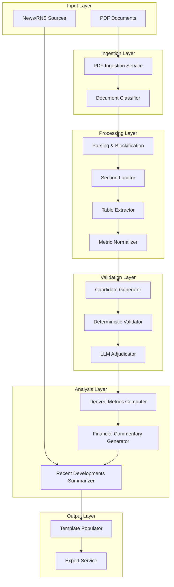
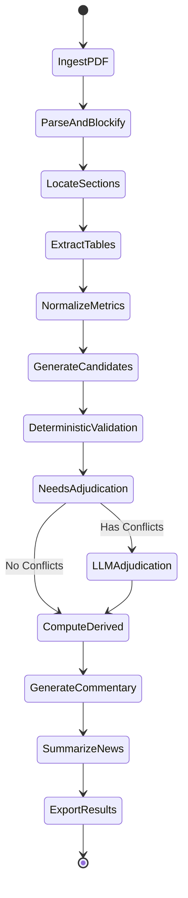
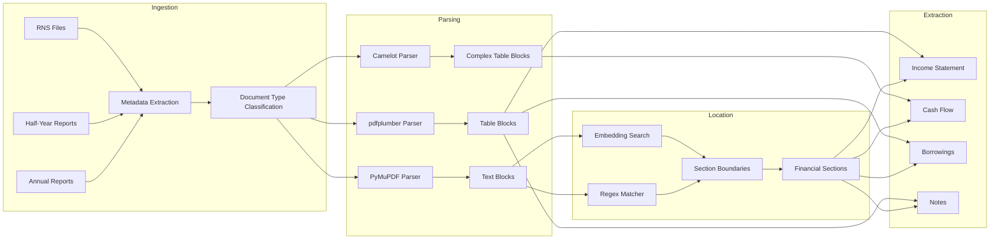
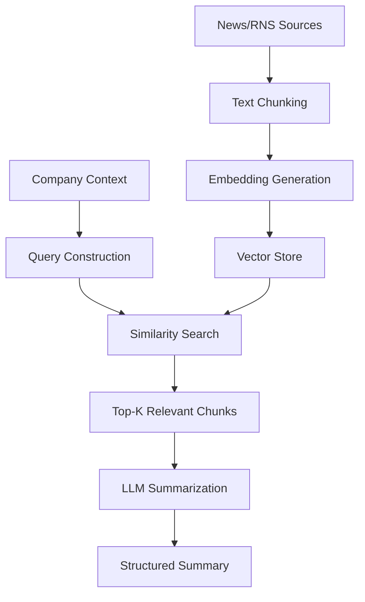
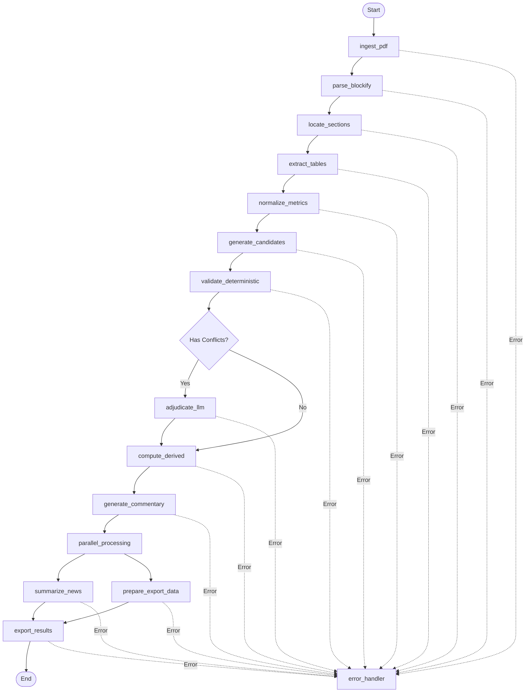

# AI Financial Agent - LangGraph Architecture Design

## Overview

### Purpose
This system is an intelligent financial document processing agent designed to extract, validate, normalize, and analyze financial metrics from company reports (Annual Reports, Half-Year Reports, RNS files). The agent uses LangGraph to orchestrate a multi-stage pipeline that combines deterministic parsing, machine learning-based extraction, LLM-powered validation, and automated financial analysis.

### Core Value Proposition
- **Automated Financial Intelligence**: Transform unstructured PDF financial reports into structured, validated, and analyzed financial data
- **Multi-Source Validation**: Generate multiple candidate values per metric with evidence-based justification and intelligent conflict resolution
- **Deterministic + AI Hybrid**: Combine rule-based validation with LLM-powered adjudication for high accuracy
- **End-to-End Automation**: From PDF ingestion to formatted output in TRS Word/Excel templates

### Target Users
- Financial analysts
- Investment research teams
- Credit risk assessment teams
- Automated financial data aggregation platforms

### Repository Type
Backend Application / CLI Tool hybrid - A Python-based data processing pipeline with potential CLI interface

## Technology Stack

### Core Framework
- **LangGraph**: Orchestration of the multi-agent workflow with state management and conditional routing
- **Python**: Primary development language

### PDF Processing
- **PyMuPDF (fitz)**: Primary PDF parsing engine
- **pdfplumber**: Table detection and extraction
- **Camelot**: Advanced table extraction (no OCR fallback strategy)

### AI/ML Components
- **LLM Integration**: For adjudication, commentary generation, and summarization
- **Embeddings**: For semantic search and financial section location
- **RAG (Retrieval-Augmented Generation)**: For recent developments summarization from news/RNS chunks

### Data Processing
- **Regex**: Pattern matching for section identification
- **Pandas**: Data normalization and metric computation
- **NumPy**: Numerical operations for financial calculations

### Output Generation
- **python-docx**: Word document generation
- **openpyxl**: Excel template population

## Architecture

### High-Level System Architecture



### LangGraph State Machine Architecture

The system operates as a state machine where each node represents a processing stage and edges define the flow of financial data through validation and enrichment.



## Data Flow Architecture

### Document Processing Pipeline



## Core Component Architecture

### 1. PDF Ingestion Service

**Responsibility**: Accept and prepare company financial documents for processing

**Input Specification**:
- PDF files (Annual Reports, Half-Year Reports, RNS files)
- Metadata: company identifier, report type, fiscal period

**Processing Strategy**:
- Validate PDF integrity and readability
- Extract document metadata (title, date, company name)
- Classify document type using pattern matching
- Route to appropriate parsing strategy

**Output Specification**:
- Document object with classified type
- Extracted metadata fields
- Raw PDF byte stream

### 2. Parsing & Blockification Service

**Responsibility**: Convert PDF into structured text and table blocks without OCR dependency

**Multi-Parser Strategy**:

| Parser | Primary Use Case | Strengths | Limitations |
|--------|-----------------|-----------|-------------|
| PyMuPDF | Text extraction, page layout | Fast, accurate text positioning | Limited complex table support |
| pdfplumber | Simple tables, text analysis | Good table detection | Performance on large documents |
| Camelot | Complex financial tables | High accuracy for bordered tables | Requires clear table structures |

**Blockification Logic**:
- Identify page boundaries and preserve page references
- Segment text into logical blocks (paragraphs, headings, footnotes)
- Extract tables with cell boundaries and spanning information
- Maintain source references (page number, block coordinates)

**Output Specification**:
- List of text blocks with position metadata
- List of table blocks with structure information
- Block type classification (heading, body, table, footnote)

### 3. Section Locator

**Responsibility**: Identify financial statement sections within the document using hybrid regex and embedding approach

**Target Sections**:
- Income Statement (P&L, Statement of Comprehensive Income)
- Cash Flow Statement
- Balance Sheet (Borrowings, Debt sections)
- Notes to Financial Statements

**Dual-Strategy Approach**:

**Regex-Based Detection**:
- Pattern library for common section headers
- Case-insensitive matching with fuzzy tolerance
- Keyword variations (e.g., "Revenue", "Turnover", "Sales")

**Embedding-Based Semantic Search**:
- Pre-compute embeddings for financial section archetypes
- Calculate similarity scores for text blocks
- Use threshold-based classification
- Handle non-standard section naming

**Conflict Resolution**:
- Prioritize regex matches for high-confidence patterns
- Use embeddings for ambiguous or non-standard sections
- Combine scores with weighted voting

**Output Specification**:
- Section boundaries (start page, end page, block range)
- Section type classification
- Confidence score per section

### 4. Table Extractor

**Responsibility**: Extract structured financial tables with complete metadata

**Extraction Requirements**:
- Table headers (row and column headers)
- Units of measurement (millions, thousands, currency)
- Time periods (FY2023, H1 2024, Q3)
- Page references
- Footnote markers and references

**Table Structure Detection**:
- Identify header rows (single or multi-level headers)
- Detect merged cells and hierarchical columns
- Parse currency symbols and unit indicators
- Extract data cells with type inference (numeric, string, null)

**Metadata Enrichment**:
- Currency normalization (GBP, USD, EUR)
- Scale detection (millions, thousands, actual)
- Period parsing (fiscal year, quarter, month)
- Consolidated vs parent entity flags

**Output Specification**:
- Structured table with header mappings
- Metadata dictionary (currency, units, period)
- Source page reference
- Cell-level provenance tracking

### 5. Metric Normalizer

**Responsibility**: Standardize financial metrics across different reporting formats and periods

**Target Metrics**:
- Revenue
- EBITDA (Earnings Before Interest, Tax, Depreciation, Amortization)
- Debt (Total Debt, Net Debt, Long-term Debt)
- Cash and Cash Equivalents
- Operating Profit
- Net Income

**Normalization Operations**:

| Operation | Purpose | Example |
|-----------|---------|---------|
| Currency Conversion | Unified currency reporting | GBP → USD using historical rate |
| Scale Adjustment | Consistent magnitude | Millions → Thousands |
| Period Mapping | Time series alignment | H1 2024 → 2024-06-30 |
| Label Standardization | Canonical metric names | "Turnover" → "Revenue" |
| Sign Convention | Consistent positive/negative | Expenses as positive values |

**Consistency Checks**:
- Validate currency conversions with exchange rate sources
- Ensure scale consistency within same document
- Verify period chronology
- Flag unusual period-over-period changes

**Output Specification**:
- Normalized metric table with standard schema
- Transformation log (original → normalized)
- Confidence indicators per metric

### 6. Candidate Generator

**Responsibility**: Generate multiple candidate values for each metric with source evidence and justification

**Multi-Source Strategy**:
- Extract metric from primary financial statement
- Cross-reference with notes and supplementary tables
- Check narrative sections for cited figures
- Consider reconciliation tables

**Candidate Structure**:

| Field | Description | Example |
|-------|-------------|---------|
| Metric Name | Standardized metric identifier | "Revenue" |
| Value | Numeric amount | 1250.5 |
| Unit | Scale and currency | "GBP Millions" |
| Source | Location in document | "Income Statement, Page 15" |
| Justification | Extraction reasoning | "Primary revenue line before deductions" |
| Confidence Score | Algorithm confidence | 0.95 |
| Supporting Evidence | Text snippet or table cell | "Revenue for year: £1,250.5m" |

**Evidence Collection**:
- Capture surrounding context (table caption, preceding text)
- Extract footnote references
- Record calculation methods if derived

**Output Specification**:
- List of candidates per metric (typically 2-5 candidates)
- Ranked by confidence score
- Complete provenance chain

### 7. Deterministic Validator

**Responsibility**: Apply rule-based validation to filter and verify candidate values

**Validation Rules**:

**Unit Consistency**:
- All candidates for same metric must convert to same unit
- Flag candidates with incompatible scales
- Reject candidates with missing or ambiguous units

**Arithmetic Verification**:
- Validate sum relationships (subtotals = total)
- Check ratio calculations (margins, percentages)
- Verify year-over-year delta calculations

**Year-over-Year Delta Checks**:
- Flag unrealistic growth rates (>500% or <-90%)
- Validate sign consistency (profit → loss transitions)
- Check for decimal point errors (1000x magnitude errors)

**Consolidated vs Parent Entity**:
- Verify entity level is consistent with document type
- Flag mismatches between standalone and group accounts
- Validate consolidation adjustments

**Range Checks**:
- Industry-specific plausibility ranges
- Historical trend conformance
- Peer comparison (if available)

**Output Specification**:
- Validated candidates (passed all checks)
- Rejected candidates with failure reasons
- Flagged candidates requiring LLM adjudication

### 8. LLM Adjudicator (LangGraph Node)

**Responsibility**: Resolve conflicting candidate values using language model reasoning when deterministic validation is inconclusive

**Trigger Conditions**:
- Multiple high-confidence candidates with conflicting values
- Ambiguous evidence requiring contextual interpretation
- Complex accounting treatments needing expert judgment
- Non-standard reporting formats

**LangGraph Node Design**:

**Input State**:
- Metric identifier
- List of conflicting candidates with evidence
- Validation results from deterministic checker
- Document context (section text, surrounding tables)

**LLM Prompt Strategy**:
- Present candidates with supporting evidence
- Provide financial reporting context
- Request reasoning-based decision
- Ask for confidence level and explanation

**Decision Logic**:
- Quote-based tie-breaking (prefer candidates with direct quotes)
- Source hierarchy (primary statements > notes > narrative)
- Recency preference (latest period data when ambiguous)
- Conservatism principle (lower value for assets, higher for liabilities)

**Output State**:
- Selected candidate value
- Reasoning explanation
- Confidence level
- Alternative interpretations if any

**Fallback Mechanism**:
- If LLM confidence < threshold, flag for human review
- Return all candidates with uncertainty marker

### 9. Derived Metrics Computer

**Responsibility**: Calculate financial ratios and period-over-period changes from validated base metrics

**Computed Metrics**:

| Metric Category | Specific Metrics | Formula |
|----------------|------------------|---------|
| Growth Rates | YoY Revenue Growth | (Revenue_t / Revenue_t-1 - 1) × 100% |
| | YoY EBITDA Growth | (EBITDA_t / EBITDA_t-1 - 1) × 100% |
| Profitability | EBITDA Margin | (EBITDA / Revenue) × 100% |
| | Net Margin | (Net Income / Revenue) × 100% |
| | Operating Margin | (Operating Profit / Revenue) × 100% |
| Leverage | Debt-to-Equity | Total Debt / Total Equity |
| | Net Debt / EBITDA | (Total Debt - Cash) / EBITDA |
| | Interest Coverage | EBITDA / Interest Expense |
| Liquidity | Current Ratio | Current Assets / Current Liabilities |
| | Cash Ratio | Cash / Current Liabilities |

**Calculation Requirements**:
- Use validated base metrics only
- Handle missing data gracefully (mark as N/A, not zero)
- Apply appropriate rounding rules
- Preserve calculation provenance

**Validation of Derived Metrics**:
- Sanity check ratios against industry norms
- Flag extreme values (e.g., margin > 100%)
- Verify mathematical consistency

**Output Specification**:
- Table of derived metrics with formulas
- Calculation transparency (show input values)
- Temporal series for trend analysis

### 10. Financial Commentary Generator

**Responsibility**: Produce AI-generated narrative analysis using validated financial facts only

**Input Requirements**:
- Validated base metrics
- Derived metrics and ratios
- Year-over-year changes
- Document context (management discussion if available)

**Commentary Scope**:

**Recent Trading Performance**:
- Revenue trends and drivers
- Profitability analysis
- Notable period-over-period changes

**Capital Structure Analysis**:
- Debt levels and composition
- Liquidity position
- Changes in financing arrangements

**Generation Constraints**:
- Use only validated facts (no speculation)
- Cite specific metric values
- Highlight significant changes (>10% YoY)
- Maintain neutral, factual tone
- Flag uncertainties or data gaps

**LLM Prompt Design**:
- Provide structured metric data as context
- Request bullet-point format
- Specify fact-checking requirement
- Define tone and style guidelines

**Output Specification**:
- Structured commentary sections
- Inline metric citations
- Confidence markers for interpretations

### 11. Recent Developments Summarizer

**Responsibility**: Aggregate and summarize relevant news and RNS announcements using RAG

**Data Sources**:
- RNS (Regulatory News Service) announcements
- Financial news articles
- Press releases
- Analyst reports

**RAG Architecture**:



**Processing Steps**:
1. **Document Collection**: Gather RNS files and news articles for the company and period
2. **Chunking Strategy**: Split documents into semantic chunks (paragraph or sentence-level)
3. **Embedding**: Generate vector embeddings for each chunk
4. **Query Formation**: Use company name, report period, and key metrics as query context
5. **Retrieval**: Find top-K most relevant chunks (K=10-20)
6. **Summarization**: LLM generates concise summary from retrieved chunks

**Summarization Requirements**:
- Focus on material events affecting financial position
- Include dates and sources
- Prioritize regulatory announcements over news
- Filter out redundant or stale information

**Output Specification**:
- Chronological summary of developments
- Source attribution per item
- Relevance score

### 12. Export Service

**Responsibility**: Populate TRS Word and Excel templates with all generated outputs

**Output Artifacts**:

**Word Document Structure**:
- Executive summary
- Financial metrics table
- Derived metrics and ratios
- AI-generated commentary
- Recent developments summary
- Data sources and methodology notes

**Excel Workbook Structure**:

| Sheet | Content |
|-------|---------|
| Summary | Key metrics dashboard |
| Income Statement | Time series of P&L metrics |
| Balance Sheet | Time series of balance sheet items |
| Cash Flow | Cash flow statement metrics |
| Ratios | Calculated financial ratios |
| Validation Log | Candidate selection audit trail |
| Sources | Document references and page numbers |

**Template Population Logic**:
- Map metric identifiers to template placeholders
- Apply formatting rules (currency, percentages, dates)
- Insert tables with appropriate styling
- Embed hyperlinks to source pages

**Quality Assurance**:
- Validate all placeholders are filled
- Check formula integrity in Excel
- Verify formatting consistency
- Generate metadata (creation date, version, source documents)

**Output Specification**:
- Populated Word document (.docx)
- Populated Excel workbook (.xlsx)
- Export log with statistics

## LangGraph Workflow Design

### State Schema

The LangGraph state object maintains all intermediate and final outputs throughout the pipeline:

```
State:
  - document_metadata: Document identifiers and classification
  - raw_pdf_path: File system reference to original PDF
  - text_blocks: Parsed text segments with positions
  - table_blocks: Extracted table structures
  - sections: Located financial statement sections
  - extracted_tables: Tables with metadata and structure
  - raw_metrics: Unnormalized metric values
  - normalized_metrics: Standardized metrics
  - candidates: Multi-candidate values with evidence
  - validation_results: Deterministic validation outputs
  - adjudication_results: LLM decisions on conflicts
  - validated_metrics: Final selected metric values
  - derived_metrics: Calculated ratios and changes
  - commentary: AI-generated financial analysis
  - recent_developments: Summarized news and RNS
  - export_paths: Generated output file locations
  - errors: Processing errors and warnings
  - provenance: Audit trail of all decisions
```

### Node Definitions

| Node Name | Input State Fields | Output State Fields | Purpose |
|-----------|-------------------|---------------------|---------|
| ingest_pdf | raw_pdf_path | document_metadata, raw_pdf_path | Validate and classify document |
| parse_blockify | raw_pdf_path, document_metadata | text_blocks, table_blocks | Parse PDF into structured blocks |
| locate_sections | text_blocks | sections | Find financial statement sections |
| extract_tables | table_blocks, sections | extracted_tables | Extract tables with metadata |
| normalize_metrics | extracted_tables | raw_metrics, normalized_metrics | Standardize metric values |
| generate_candidates | normalized_metrics, text_blocks | candidates | Create multi-candidate values |
| validate_deterministic | candidates | validation_results | Apply rule-based validation |
| adjudicate_llm | validation_results, candidates | adjudication_results | Resolve conflicts with LLM |
| compute_derived | validated_metrics | derived_metrics | Calculate ratios and changes |
| generate_commentary | validated_metrics, derived_metrics | commentary | Produce AI analysis |
| summarize_news | document_metadata | recent_developments | RAG-based news summary |
| export_results | All state fields | export_paths | Generate Word/Excel outputs |

### Conditional Edges

**Adjudication Router**:
- Condition: `validation_results.has_conflicts == True`
- If True: Route to `adjudicate_llm` node
- If False: Skip to `compute_derived` node

**Error Handling**:
- Any node can transition to `error_handler` node on exception
- Error handler logs issue and determines if pipeline can continue or must halt

### Graph Structure



## Testing Strategy

### Unit Testing

**Component-Level Tests**:

| Component | Test Scenarios |
|-----------|---------------|
| PDF Parsers | Valid PDF parsing, corrupted file handling, multi-page documents |
| Section Locator | Standard section headers, non-standard naming, missing sections |
| Table Extractor | Simple tables, merged cells, multi-level headers, footnotes |
| Metric Normalizer | Currency conversion, scale adjustment, period parsing |
| Deterministic Validator | Unit checks, arithmetic validation, range violations |
| Derived Calculator | Ratio formulas, division by zero, missing data handling |

**Test Data Requirements**:
- Sample financial PDFs with known ground truth
- Edge cases (malformed tables, missing sections)
- Multi-year reports for temporal validation

### Integration Testing

**Pipeline Tests**:
- End-to-end processing of complete annual report
- Multi-document batch processing
- Error recovery and retry mechanisms
- State persistence across node transitions

**LangGraph-Specific Tests**:
- State transitions and persistence
- Conditional routing logic
- Parallel node execution
- Error propagation and handling

### Validation Testing

**Accuracy Metrics**:
- Metric extraction accuracy (vs. manual extraction)
- Candidate ranking precision
- Adjudication decision quality
- Derived metric correctness

**Performance Metrics**:
- Processing time per document
- LLM call latency and cost
- Memory usage for large documents
- Throughput (documents per hour)

### LLM Testing

**Adjudication Quality**:
- Agreement with human expert decisions
- Consistency across similar scenarios
- Reasoning quality assessment
- Hallucination detection (fact-checking against source)

**Commentary Quality**:
- Factual accuracy
- Relevance to extracted metrics
- Absence of speculation
- Citation completeness

## Configuration Management

### System Configuration

| Parameter Category | Configuration Items |
|-------------------|---------------------|
| PDF Processing | Parser priority order, fallback strategies, timeout settings |
| Section Detection | Regex patterns, embedding model selection, similarity thresholds |
| Table Extraction | Detection sensitivity, cell merging rules, header detection logic |
| Normalization | Currency conversion API, exchange rate sources, unit mappings |
| Validation | Tolerance thresholds, range boundaries, rule weights |
| LLM Integration | Model selection, temperature, max tokens, retry policy |
| RAG | Chunk size, overlap, top-K retrieval, embedding model |
| Export | Template paths, formatting rules, output directory |

### Environment-Specific Settings

**Development**:
- Mock LLM responses for testing
- Verbose logging
- Local file storage
- Limited batch size

**Production**:
- Production LLM endpoints
- Error-level logging
- Cloud storage integration
- Full-scale batch processing
- Monitoring and alerting hooks

## Error Handling Strategy

### Error Categories

| Error Type | Handling Strategy | Recovery Action |
|------------|------------------|-----------------|
| PDF Corruption | Log error, skip document | Return partial results if some pages parsed |
| Section Not Found | Use fallback heuristics | Flag document for manual review |
| Table Extraction Failure | Try alternative parser | Use text-based extraction as fallback |
| Validation Failure | Route to LLM adjudication | Human review if LLM uncertain |
| LLM API Failure | Retry with exponential backoff | Use cached results or skip commentary |
| Template Population Error | Log field-level errors | Generate partial output with gaps flagged |

### Logging and Observability

**Structured Logging**:
- Document identifier in all log entries
- Processing stage markers
- Timing information per node
- Decision audit trail (why each candidate selected/rejected)

**Monitoring Metrics**:
- Success/failure rates per stage
- Processing latency distribution
- LLM token usage and costs
- Validation rule trigger frequencies

## Data Models

### Document Metadata

| Field | Type | Description |
|-------|------|-------------|
| document_id | String | Unique identifier |
| company_name | String | Company name |
| company_identifier | String | Ticker or registry number |
| report_type | Enum | Annual, Half-Year, RNS |
| fiscal_period_end | Date | Reporting period end date |
| currency | String | Primary reporting currency |
| filing_date | Date | Document publication date |
| source_path | String | Original file location |

### Financial Metric

| Field | Type | Description |
|-------|------|-------------|
| metric_id | String | Canonical metric identifier |
| metric_name | String | Display name |
| value | Decimal | Numeric amount |
| currency | String | Currency code |
| scale | String | millions, thousands, actual |
| period_end_date | Date | Reporting period |
| entity_type | Enum | consolidated, parent, subsidiary |
| source_page | Integer | Page number in PDF |
| source_section | String | Section name |
| extraction_method | Enum | table, text, calculated |

### Candidate Value

| Field | Type | Description |
|-------|------|-------------|
| candidate_id | String | Unique candidate identifier |
| metric_id | String | Associated metric |
| value | Decimal | Proposed value |
| confidence_score | Float | 0.0 to 1.0 |
| source_reference | String | Location in document |
| justification | String | Extraction reasoning |
| supporting_evidence | String | Text snippet or table cell content |
| extraction_timestamp | DateTime | When extracted |

### Validation Result

| Field | Type | Description |
|-------|------|-------------|
| candidate_id | String | Candidate being validated |
| rule_name | String | Validation rule applied |
| result | Enum | pass, fail, warning |
| message | String | Explanation of result |
| severity | Enum | critical, major, minor |

## Security and Compliance

### Data Privacy
- No storage of sensitive personal information
- Document retention policies configurable
- Audit logs for all data access

### Financial Data Integrity
- Immutable audit trail of all metric selections
- Version control for calculation methodologies
- Traceability from output back to source PDF page

### LLM Safety
- Input sanitization to prevent prompt injection
- Output validation to detect hallucinations
- Rate limiting and cost controls

## Extensibility Points

### Custom Parsers
- Plugin architecture for additional PDF parsing libraries
- Configurable parser priority and fallback chains

### Custom Metrics
- Extensible metric catalog
- User-defined calculation formulas for derived metrics

### Custom Validation Rules
- Rule engine for domain-specific validations
- Configurable thresholds and tolerances

### Custom Output Formats
- Template engine for different report formats
- API endpoints for programmatic access to results

### Multi-Language Support
- Internationalization of section detection patterns
- Multi-lingual commentary generation

## Performance Considerations

### Optimization Strategies

| Optimization Area | Strategy |
|------------------|----------|
| PDF Parsing | Parallel page processing, parser result caching |
| Embeddings | Batch embedding generation, vector caching |
| LLM Calls | Request batching, response caching, prompt optimization |
| Table Extraction | Region-of-interest pre-filtering, lazy evaluation |
| Database Access | Connection pooling, query optimization, indexing |

### Scalability

**Horizontal Scaling**:
- Stateless node design enables distributed processing
- Document-level parallelism (process multiple reports simultaneously)
- LangGraph checkpointing for fault tolerance

**Vertical Scaling**:
- Memory optimization for large PDFs (streaming processing)
- GPU acceleration for embedding generation

### Resource Management

**Memory**:
- Streaming PDF processing to limit memory footprint
- Garbage collection of intermediate state
- Configurable batch sizes

**Compute**:
- CPU-intensive tasks (parsing) separated from I/O-bound tasks
- Async/await for LLM API calls
- Worker pool for parallel document processing

**Cost Control**:
- LLM call budgeting and monitoring
- Caching of expensive operations
- Graceful degradation when budget exceeded
